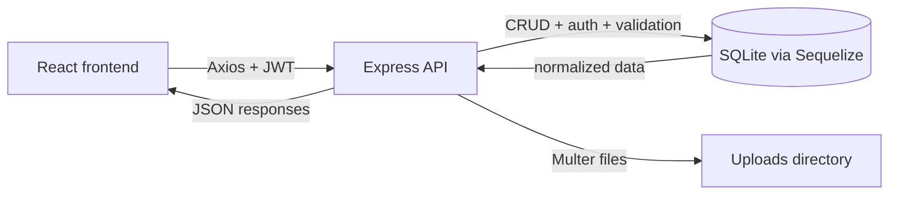
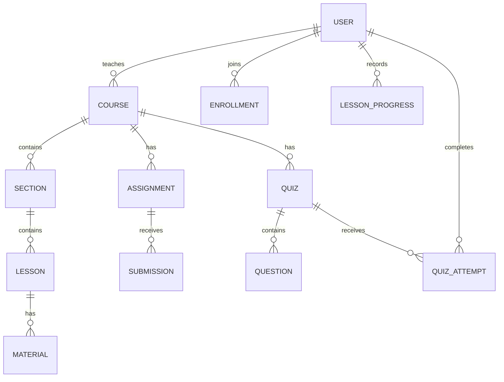
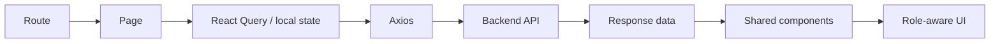
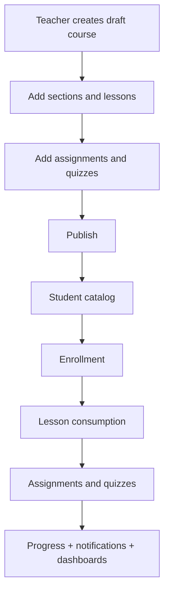
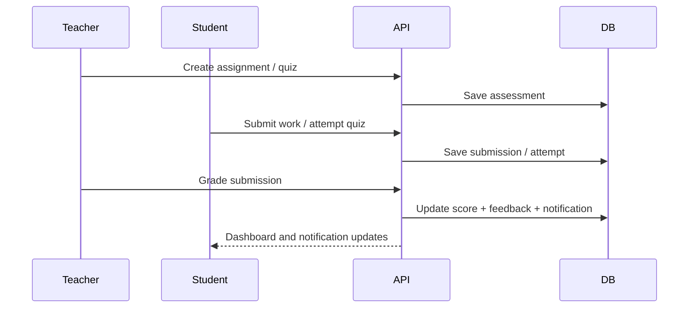

# Architecture

## Overview

This project is a school-focused e-learning platform with a React frontend and an Express API backend.

- Frontend: React + Vite + Tailwind CSS
- Backend: Express + Sequelize
- Primary database: SQLite
- Optional migration source: PostgreSQL
- Authentication: JWT bearer tokens
- File handling: Multer + `/uploads`

At a high level:

1. The frontend calls the backend API through Axios.
2. The backend validates requests, checks auth/roles, and runs controller logic.
3. Controllers use Sequelize models and associations to read/write data.
4. The frontend uses React Query to fetch, cache, and refresh server state.

## Visual System Map



## Top-Level Structure

```text
E-Learning Platform/
├── backend/
│   ├── src/
│   │   ├── config/
│   │   ├── controllers/
│   │   ├── middleware/
│   │   ├── models/
│   │   ├── routes/
│   │   └── utils/
│   └── tests/
├── frontend/
│   ├── src/
│   │   ├── api/
│   │   ├── components/
│   │   ├── context/
│   │   ├── hooks/
│   │   ├── pages/
│   │   └── utils/
│   └── tests/
├── README.md
├── ARCHITECTURE.md
└── PROJECT_SETUP.md
```

## Backend Architecture

### Request Flow

Typical backend flow:

1. `backend/src/server.js` starts the server and connects to the database.
2. `backend/src/app.js` configures middleware such as CORS, Helmet, logging, JSON parsing, and static uploads.
3. `backend/src/routes/index.js` mounts route groups under `/api`.
4. Route files apply auth, validation, and then call a controller.
5. Controllers orchestrate model queries and return normalized API responses.

### Backend Layers

`config/`
- Database bootstrapping and dialect selection.
- SQLite is the default runtime database.
- PostgreSQL is supported as a migration source.

`models/`
- Sequelize model definitions and associations.
- Central model bootstrap lives in [backend/src/models/index.js](/Users/hanan/Documents/E-Learning Platform/backend/src/models/index.js:1).

`routes/`
- Endpoint definitions.
- Validation is handled with `express-validator`.
- Auth/role checks are applied close to route boundaries.

`controllers/`
- Core business logic for auth, admin, teacher, courses, assignments, quizzes, notifications, and progress.

`middleware/`
- Auth middleware
- Validation error handling
- Upload middleware
- Rate limiting
- Global error handling

`utils/`
- Seeding
- DB sync
- PostgreSQL-to-SQLite migration
- Response helpers
- Domain helpers for courses, quizzes, assignments, and auth

### Route Groups

Mounted in [backend/src/routes/index.js](/Users/hanan/Documents/E-Learning Platform/backend/src/routes/index.js:1):

- `/api/auth`
- `/api/admin`
- `/api/teacher`
- `/api/courses`
- Assignment, content, notification, progress, and quiz routes mounted at `/api/...`

### Data Model

Core entities:

- `User`
- `Course`
- `Section`
- `Lesson`
- `Material`
- `Enrollment`
- `Assignment`
- `Submission`
- `Quiz`
- `Question`
- `QuizAttempt`
- `Notification`
- `LessonProgress`

Important relationships:

- A teacher owns many courses.
- A course has many sections, lessons, materials, assignments, quizzes, enrollments, and progress entries.
- A student has many enrollments, submissions, quiz attempts, notifications, and lesson progress entries.
- Enrollment records can outlive course publication state changes; student access is governed by course visibility rules, not enrollment deletion.
- Assignments have many submissions.
- Quizzes have many questions and attempts.

### Entity Relationship Snapshot



## Frontend Architecture

### Frontend Flow

Typical frontend flow:

1. A route renders a page from `frontend/src/pages`.
2. The page uses React Query hooks or local state to fetch data.
3. Axios sends requests to the backend API.
4. Shared layout/components render lists, forms, charts, and actions.
5. Auth context provides the current user and role-aware access behavior.

### Frontend Interaction Flow



### Frontend Layers

`api/`
- Axios client configuration and API base URL wiring.

`context/`
- Auth context and session state.

`hooks/`
- Shared logic such as auth access and notifications polling.

`components/`
- Layout
- UI primitives
- Feature-specific components for admin, teacher, assignments, courses, and notifications

`pages/`
- Role-based page groups:
  - `admin/`
  - `teacher/`
  - `student/`
  - `auth/`
  - `shared/`

`utils/`
- Formatters and other UI helpers.

### Routing

Routing is handled in [frontend/src/App.jsx](/Users/hanan/Documents/E-Learning Platform/frontend/src/App.jsx:1).

Protected sections:

- Admin routes under `/admin`
- Teacher routes under `/teacher`
- Student routes under `/student`
- Shared authenticated notifications route under `/notifications`

Role-based protection is enforced by `ProtectedRoute`.

## Authentication and Authorization

Authentication model:

- Users log in through `/api/auth/login`
- The frontend stores the JWT-based session state through the auth context
- Authenticated requests include the bearer token

Authorization model:

- `admin`: user management, course oversight, reports
- `teacher`: course delivery, grading, quiz/assignment authoring
- `student`: enrollment, learning progress, submissions, quiz attempts

## Runtime Data Flow

### Course Content

1. Admin or teacher creates/publishes courses.
2. Teachers create sections, lessons, materials, assignments, and quizzes.
3. Students enroll and consume lessons/materials.
4. Progress is tracked through enrollments and lesson progress records.

Course visibility rules:

- `Published`: student-visible, enrollable, and accessible
- `Draft/Unpublished`: hidden and inaccessible to students, even if enrollment records already exist
- A separate state such as `Archived` or `Private` should be introduced if existing students must retain access while new enrollments are blocked

### Course Content Flow



### Assessment Flow

1. Teacher creates assignments and quizzes.
2. Student submits assignments or completes quiz attempts.
3. Teacher grades submissions.
4. Scores feed:
   - student dashboards
   - teacher views
   - admin reports
   - notifications

### Assessment Sequence



### Reporting Flow

Admin reports aggregate:

- user counts
- enrollments
- graded submissions
- platform score distribution
- course attention signals
- student rankings

These metrics are computed server-side in the admin controller and rendered in the admin reports UI.

## Database Strategy

Default local runtime:

- SQLite file at `backend/data/elearning.sqlite`

Supported special workflow:

- One-time PostgreSQL import using `npm run db:migrate:postgres-to-sqlite`

Database initialization utilities:

- `npm run db:sync`
- `npm run seed`

## File Uploads

Uploads are stored under the backend uploads directory and served statically from:

- `/uploads`

This is configured in [backend/src/app.js](/Users/hanan/Documents/E-Learning Platform/backend/src/app.js:1) and initialized in [backend/src/server.js](/Users/hanan/Documents/E-Learning Platform/backend/src/server.js:1).

## Testing Strategy

Backend:

- Jest
- Supertest

Frontend:

- Vitest
- React Testing Library

Current test commands:

- `cd backend && npm test`
- `cd frontend && npm test`

## Operational Notes

- API requests are rate-limited.
- Notification data is polled on the frontend.
- SQLite is the main dev/runtime database.
- The codebase is organized by domain and role rather than by a single monolithic module.

## Operational Pulse

| Layer | Live Responsibility |
| --- | --- |
| Frontend | role-based pages, cached queries, fast UI updates |
| Backend | auth, validation, business rules, normalized responses |
| Database | courses, enrollments, grades, attempts, lesson progress |
| Uploads | course files and lesson assets served through `/uploads` |

## Suggested Future Improvements

- Add service/repository separation if backend complexity grows.
- Add dedicated migrations instead of sync-only lifecycle management.
- Move shared API contracts to typed schemas for stronger frontend-backend alignment.
- Add audit logging for admin/teacher actions.
