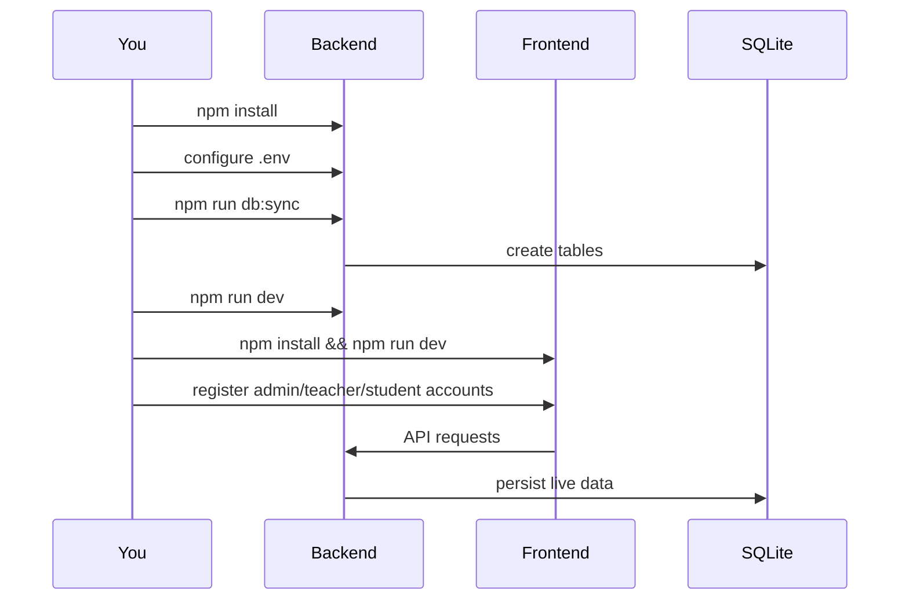
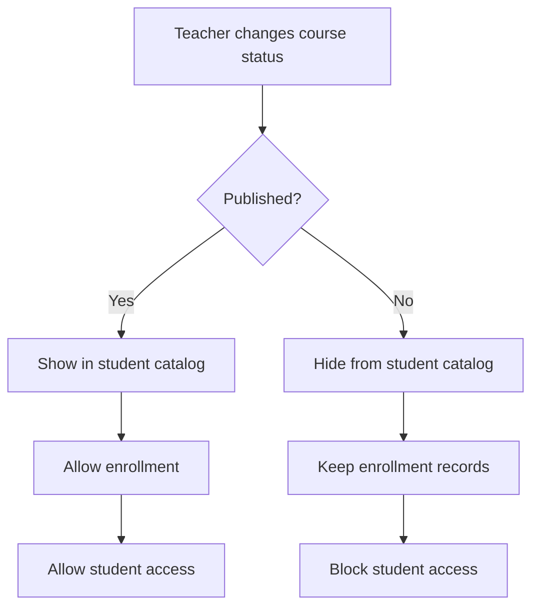

# Project Setup

## Purpose

This guide explains how to install, configure, run, seed, reset, and test the E-Learning Platform locally.

## Prerequisites

Install these first:

- Node.js 18+ recommended
- npm
- Git

Optional:

- DB Browser for SQLite or another SQLite client
- PostgreSQL only if you plan to use the migration script

## Project Layout

```text
E-Learning Platform/
├── backend/
├── frontend/
├── README.md
├── ARCHITECTURE.md
└── PROJECT_SETUP.md
```

## Setup Flow Map

```mermaid
flowchart LR
    A[Clone repo] --> B[Backend npm install]
    B --> C[Create backend env]
    C --> D[db:sync]
    D --> E[Start backend]
    E --> F[Frontend npm install]
    F --> G[Create frontend env]
    G --> H[Start frontend]
    H --> I[Register users]
    I --> J[Create courses and publish]
```



## 1. Clone the Project

```bash
git clone <your-repo-url>
cd "E-Learning Platform"
```

## 2. Backend Setup

Install dependencies:

```bash
cd backend
npm install
```

Create `backend/.env`:

```env
# App
PORT=5001
NODE_ENV=development
FRONTEND_ORIGIN=http://localhost:5173
UPLOAD_DIR=uploads

# Auth
JWT_SECRET=replace_this_with_a_long_random_secret
JWT_EXPIRES_IN=7d

# Primary runtime database
DB_DIALECT=sqlite
SQLITE_STORAGE=./data/elearning.sqlite

```

Initialize the database:

```bash
npm run db:sync
```

Start the backend:

```bash
npm run dev
```

Useful backend scripts:

- `npm run dev` - start backend with nodemon
- `npm start` - start backend normally
- `npm test` - run backend tests
- `npm run db:sync` - create/update tables from models
- `npm run seed` - insert demo data
- `npm run db:migrate:postgres-to-sqlite` - import PostgreSQL data into SQLite

## 3. Frontend Setup

Open a new terminal:

```bash
cd frontend
npm install
```

Create `frontend/.env`:

```env
VITE_API_URL=http://localhost:5001/api
```

Start the frontend:

```bash
npm run dev
```

Useful frontend scripts:

- `npm run dev` - start Vite dev server
- `npm run build` - production build
- `npm run preview` - preview production build
- `npm test` - run frontend tests
- `npm run lint` - run ESLint

## 4. Local Development URLs

- Frontend: `http://localhost:5173`
- Backend API: `http://localhost:5001/api`
- Health check: `http://localhost:5001/api/health`

## 5. Fresh Empty-Data Setup

Use this when you want a clean client-ready instance without demo users or sample content.

Backend:

```bash
cd backend
npm install
npm run db:sync
npm run dev
```

Frontend:

```bash
cd frontend
npm install
npm run dev
```

Important:

- Do not run `npm run seed`
- Public registration now lets people choose `student` or `teacher`
- Teacher signups are created as teacher accounts immediately and also notify admins for verification
- The first `admin` role still needs to be assigned manually in the database if you start from empty data

### Create the First Admin on a Fresh Database

Use this when you have a brand-new database with no admin account yet.

1. Start the backend and frontend.
2. Register a normal account from the app with the credentials you want to use as the primary admin.
3. Open the SQLite database at `backend/data/elearning.sqlite`.
4. Promote that user with SQL:

```sql
UPDATE users
SET role = 'admin'
WHERE email = 'owner@eduflow.com';
```

Example local-first admin credentials you can create for yourself:

- Email: `owner@eduflow.com`
- Password: any password that matches the app rules, for example `Admin123!`

After that, sign in with the same email and password and you will enter the admin panel.

Example SQLite role updates:

```sql
UPDATE users SET role = 'admin' WHERE email = 'owner@example.com';
UPDATE users SET role = 'teacher' WHERE email = 'teacher@example.com';
```

Default SQLite database path:

- `backend/data/elearning.sqlite`

### First-Run Journey



## 6. Demo Data Setup

Use this for development, demos, or testing with ready-made records.

```bash
cd backend
npm run seed
```

Seeded credentials:

- Admin: `admin@eduflow.com` / `Admin123!`
- Teacher: `james.wilson@eduflow.com` / `Teacher123!`
- Student 1: `liam.harris@student.edu` / `Student123!`
- Student 2: `olivia.jackson@student.edu` / `Student123!`

Registration behavior:

- Student signup: user enters the student dashboard immediately
- Teacher signup: user enters the teacher dashboard immediately
- Teacher signup also sends a notification to all admins so they can review and verify the account

## 7. Reset the Database

To reset to an empty SQLite database:

1. Stop the backend server.
2. Delete `backend/data/elearning.sqlite`.
3. Run:

```bash
cd backend
npm run db:sync
```

## 8. Optional PostgreSQL-to-SQLite Migration

If you have an existing PostgreSQL source database and want to import it into the SQLite runtime:

1. Fill in the `SOURCE_PG_*` values in `backend/.env`
2. Run:

```bash
cd backend
npm run db:migrate:postgres-to-sqlite
```

This is intended as a one-time migration workflow, not the default runtime mode.

## 9. Testing

Run backend tests:

```bash
cd backend
npm test
```

Run frontend tests:

```bash
cd frontend
npm test
```

Build the frontend:

```bash
cd frontend
npm run build
```

## 10. Course Visibility Lifecycle

The project currently uses a two-state student visibility model:

- `Published`: students can discover, enroll in, and access the course
- `Draft/Unpublished`: students cannot see or access the course, even if an enrollment record already exists

Important:

- Unpublishing a course does not delete enrollments
- It only removes student-facing visibility and blocks student access until the course is published again

If your product needs a softer state where existing students keep access but new students cannot join, add a separate lifecycle state such as `Archived` or `Private` instead of reusing `Draft/Unpublished`.

### Visibility Flowchart



## 11. Common Troubleshooting

### Port Already In Use

- Change `PORT` in `backend/.env`
- Update `VITE_API_URL` in `frontend/.env` to match

### Frontend Cannot Reach Backend

Check:

- backend is running
- `VITE_API_URL` points to the correct backend URL
- `FRONTEND_ORIGIN` matches the frontend dev URL

### SQLite File Not Created

Run:

```bash
cd backend
npm run db:sync
```

If needed, verify `SQLITE_STORAGE` in `backend/.env`.

### Login Works But Access Is Limited

This is usually a role issue.

Check the `role` column in the `users` table and confirm the user is `admin`, `teacher`, or `student` as expected.

### Uploads Not Showing

Check:

- `UPLOAD_DIR` value in backend env
- backend server is running
- files exist in the upload directory

## 12. Recommended First Run

If you want the fastest successful first run:

1. Configure backend env
2. Run `cd backend && npm install && npm run db:sync && npm run dev`
3. Configure frontend env
4. Run `cd frontend && npm install && npm run dev`
5. Open the frontend and register a user
6. Promote one account to `admin` directly in SQLite if needed

## 13. Related Docs

- [README.md](/Users/hanan/Documents/E-Learning Platform/README.md)
- [ARCHITECTURE.md](/Users/hanan/Documents/E-Learning Platform/ARCHITECTURE.md)
