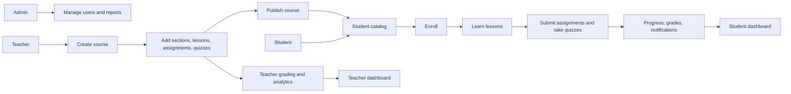
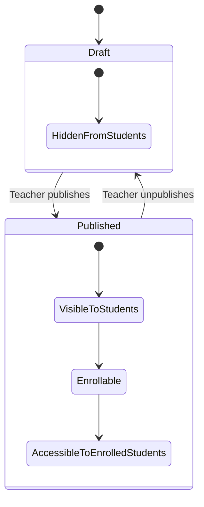
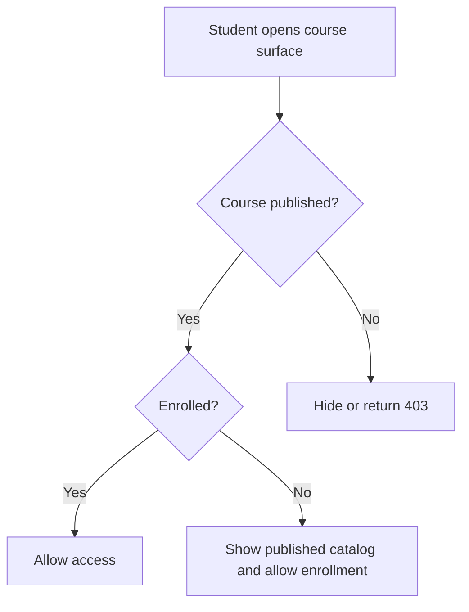
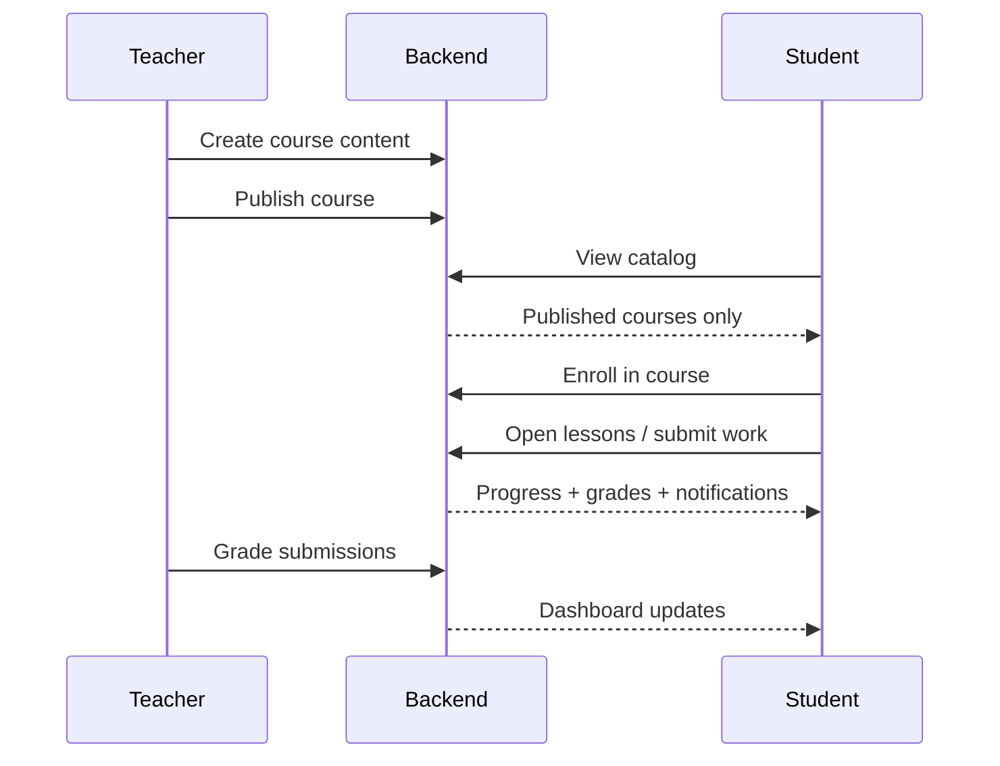

# E-Learning Platform

School-focused full-stack learning platform built with React, Express, SQLite, Sequelize, JWT, Tailwind CSS, and Multer.

## Documentation

- [Architecture Guide](/Users/hanan/Documents/E-Learning Platform/ARCHITECTURE.md)
- [Project Setup Guide](/Users/hanan/Documents/E-Learning Platform/PROJECT_SETUP.md)

## Tech Stack

- Frontend: React, Vite, Tailwind CSS, React Router, React Query, Axios
- Backend: Node.js, Express, SQLite, Sequelize, JWT, Multer, bcryptjs
- Testing: Vitest, React Testing Library, Jest, Supertest

## Project Structure

```text
E-Learning Platform/
├── backend/
│   ├── src/
│   ├── tests/
│   └── package.json
├── frontend/
│   ├── src/
│   ├── tests/
│   └── package.json
└── README.md
```

## Visual Overview

### Platform Flow



### Course Lifecycle



### Live System Snapshot

| Signal | Meaning |
| --- | --- |
| `Published` | Students can discover, enroll, and open the course |
| `Draft/Unpublished` | Students cannot see or access the course |
| `Enrollment retained` | Enrollment record stays in the database after unpublish |
| `Access blocked` | Student routes and dashboards stop showing the course until republished |

## Setup

1. Clone the repository and move into the project:
   `git clone <your-repo-url>`
   `cd "E-Learning Platform"`

2. Install backend dependencies:
   `cd backend`
   `npm install`

3. Configure backend environment in `backend/.env`:

```env
# App
PORT=5001
NODE_ENV=development
FRONTEND_ORIGIN=http://localhost:5173
UPLOAD_DIR=uploads

# Auth
JWT_SECRET=replace_this_with_a_long_random_secret
JWT_EXPIRES_IN=7d

# Primary runtime database
DB_DIALECT=sqlite
SQLITE_STORAGE=./data/elearning.sqlite

# One-time source database for:
# npm run db:migrate:postgres-to-sqlite
```

4. Create a fresh empty SQLite database:
   `npm run db:sync`

5. Start the backend:
   `npm run dev`

6. In a new terminal, install frontend dependencies:
   `cd ../frontend`
   `npm install`

7. Configure frontend environment in `frontend/.env`:

```env
VITE_API_URL=http://localhost:5001/api
```

8. Start the frontend:
   `npm run dev`

## Fresh Data Workflow

Use this flow when handing the project to a client who should start with their own data instead of demo data.

1. Do not run `npm run seed`.
2. Run only:
   `cd backend`
   `npm run db:sync`
   `npm run dev`
3. Start the frontend:
   `cd ../frontend`
   `npm install`
   `npm run dev`
4. Open the app and register users normally from the UI.
5. Create real courses, lessons, assignments, quizzes, and enrollments from the app after the required roles are assigned.

Important limitation:
- Public registration currently creates `student` accounts only.
- To create the first `teacher` or `admin`, first register the user, then update that user's `role` in the SQLite database.

Example role updates in SQLite:

```sql
UPDATE users SET role = 'admin' WHERE email = 'owner@example.com';
UPDATE users SET role = 'teacher' WHERE email = 'teacher@example.com';
```

You can run those with any SQLite tool, such as DB Browser for SQLite, against `backend/data/elearning.sqlite`.

## Reset To Empty Data

To start over with a completely fresh database:

1. Stop the backend.
2. Delete `backend/data/elearning.sqlite`.
3. Run `cd backend && npm run db:sync`.

## Optional Demo Data

If you want demo content for development or presentations, you can still use:

```bash
cd backend
npm run seed
```

## Optional PostgreSQL Import

If you ever need to import an existing PostgreSQL database into SQLite:

1. Fill in the `SOURCE_PG_*` values in `backend/.env`.
2. Run:
   `cd backend && npm run db:migrate:postgres-to-sqlite`

## Course Visibility Rules

Student-facing course access follows these rules:

- `Published`: visible in the student catalog, enrollable, and accessible to enrolled students
- `Draft/Unpublished`: hidden from students and inaccessible on student routes, even if an enrollment record already exists
- Enrollment records are preserved when a course is unpublished; student access is blocked, not deleted

Important product note:

- If you want already-enrolled students to keep access while blocking new enrollments, use a separate lifecycle state such as `Archived` or `Private`
- Do not overload `Draft/Unpublished` for that purpose; in this project it is treated as an authoring-only state

### Student Access Decision



## Test Commands

- Backend: `cd backend && npm test`
- Frontend: `cd frontend && npm test`
- Frontend production build: `cd frontend && npm run build`

## Deploying on Vercel

### Recommended setup

Deploy the `frontend` on Vercel now.

Do not deploy the current backend to production on Vercel until you replace:

- SQLite runtime storage in `backend/data/elearning.sqlite`
- Local file uploads in `backend/uploads`

Why:

- This project currently stores production data on the local filesystem.
- Vercel is a serverless platform, so local runtime files are not the right durable place for your database or user uploads.
- Vercel's Express docs also note that `express.static()` is ignored for static asset serving, which affects the current `/uploads` setup.

### Frontend deployment steps

1. Push this repository to GitHub.
2. In Vercel, create a new project from the repo.
3. Set the project's Root Directory to `frontend`.
4. Keep the framework preset as `Vite`.
5. Add this environment variable in Vercel:

```env
VITE_API_URL=https://your-backend-domain.example.com/api
```

6. Deploy.

The frontend now includes `frontend/vercel.json` so React Router deep links work correctly on Vercel.

### Backend status for Vercel

The backend can only be considered Vercel-ready for production after these changes:

1. Move the runtime database from SQLite to PostgreSQL.
2. Move uploaded files from local disk to object storage such as Vercel Blob or S3-compatible storage.
3. Set backend environment variables for production:

```env
NODE_ENV=production
FRONTEND_ORIGIN=https://your-frontend-domain.vercel.app
JWT_SECRET=your-long-random-secret
JWT_EXPIRES_IN=7d
DB_DIALECT=postgres
DB_HOST=...
DB_PORT=5432
DB_NAME=...
DB_USER=...
DB_PASSWORD=...
```

### Best production path

Use one of these:

- Frontend on Vercel, backend on Railway/Render/Fly.io, database on Postgres
- Frontend on Vercel, backend on Vercel only after migrating to Postgres + blob storage

### Monorepo note

If you deploy both apps from the same repository, create two separate Vercel projects:

- one with Root Directory `frontend`
- one with Root Directory `backend`

## Demo Seeded Credentials

Only available if you run `npm run seed`.

- Admin: `admin@eduflow.com` / `Admin123!`
- Teacher: `james.wilson@eduflow.com` / `Teacher123!`
- Student 1: `liam.harris@student.edu` / `Student123!`
- Student 2: `olivia.jackson@student.edu` / `Student123!`

## First Admin on Fresh Data

If you start with an empty database and do not run the seed script, create the first admin like this:

1. Register a normal account from the app with the email/password you want to keep as the main admin.
2. Open `backend/data/elearning.sqlite` in SQLite.
3. Run:

```sql
UPDATE users
SET role = 'admin'
WHERE email = 'owner@eduflow.com';
```

You can use credentials such as `owner@eduflow.com` / `Admin123!` when creating that first account, as long as the password meets the app rules.

## Registration Roles

- New users choose `Student` or `Teacher` during registration.
- Students go straight to the student dashboard after account creation.
- Teachers go straight to the teacher dashboard after account creation.
- Every teacher signup also notifies admins so they can verify the account from the admin side.

## API Summary

| Area | Example Endpoints |
| --- | --- |
| Health | `GET /api/health` |
| Auth | `POST /api/auth/register`, `POST /api/auth/login`, `GET /api/auth/me` |
| Admin | `GET /api/admin/users`, `PUT /api/admin/users/:id/role`, `GET /api/admin/stats` |
| Courses | `POST /api/courses`, `GET /api/courses`, `GET /api/courses/:id`, `PUT /api/courses/:id/publish` |
| Content | `POST /api/courses/:courseId/sections`, `POST /api/sections/:sectionId/lessons`, `POST /api/lessons/:lessonId/materials` |
| Enrollment | `POST /api/courses/:id/enroll`, `DELETE /api/courses/:id/enroll`, `GET /api/courses/:id/students` |
| Assignments | `POST /api/courses/:courseId/assignments`, `POST /api/assignments/:id/submit`, `PUT /api/submissions/:id/grade` |
| Quizzes | `POST /api/courses/:courseId/quizzes`, `POST /api/quizzes/:id/attempt`, `GET /api/quizzes/:id/results` |
| Progress | `GET /api/student/dashboard`, `GET /api/teacher/dashboard`, `GET /api/courses/:id/progress` |
| Notifications | `GET /api/notifications`, `GET /api/notifications/count`, `PUT /api/notifications/read-all` |

## Visual API Flow



## Notes

- Runtime data is stored in `backend/data/elearning.sqlite`.
- Uploaded files are served from `/uploads`.
- Auth routes and API routes are rate-limited in development and production.
- `PUT /api/courses/:id/publish` toggles the course between published and unpublished states.
- Unpublished courses are hidden from student dashboards/catalog pages and blocked on student access routes.
- The frontend uses polling for notifications every 30 seconds.
